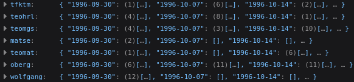
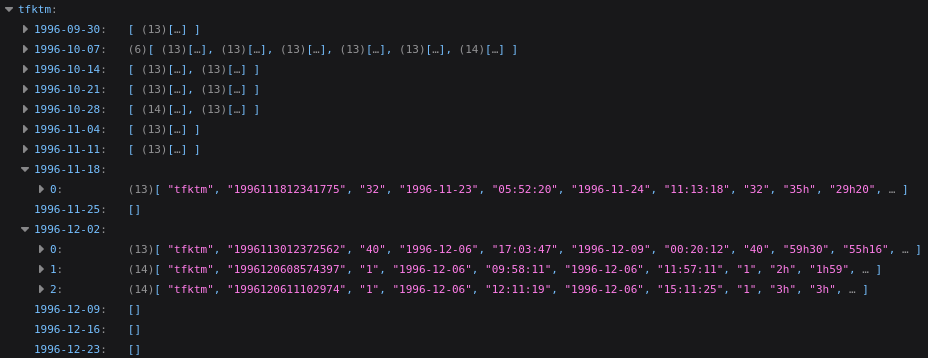
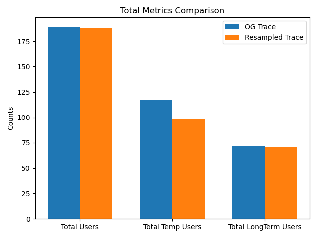
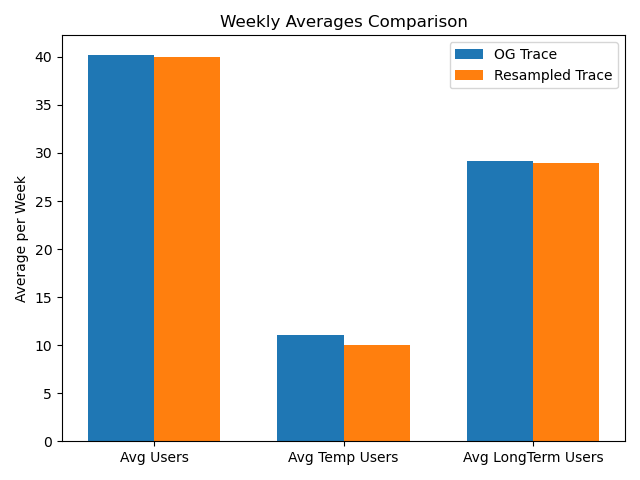

In the context of the ***Ressource Management for Embedded Systems*** class of the ***Computer Science for Aerospace*** master's degree at ***Université de Toulouse***, we had to partially reproduce experiments from the [Tuning EASY-Backfilling Queues paper](https://www.researchgate.net/publication/323419965_Tuning_EASY-Backfilling_Queues) published by Jérôme Lelong, Valentin Reis and Denis Trystram. 

# Introduction

The [Tuning EASY-Backfilling Queues paper](https://www.researchgate.net/publication/323419965_Tuning_EASY-Backfilling_Queues) paper explores the use of a backfilling queue to improve the EASY algorithm performances in High Performance Computing (HPC). Authors propose testing 7 different reordering policies in two queue: a primary and a backfilling one. They furthermore introduce the idea of using a threshold of 20h to prevent extreme maximum waiting values for large jobs. Our project implements all 7 policies, the EASY algorithm, the backfilling queue, and the threshold mechanisms, using the `batsim` library in `C++`. Experiments are conducted on generated data based on the [**KTH-SP2 workload**](https://www.cs.huji.ac.il/labs/parallel/workload/l_kth_sp2/) and respecting the authors' resampling methodology.

This `README` file contains all that is needed to understand the repo, from the concept of the experiments we aim to reproduce, to how to run programs. 
Below is a table of contents listing all of the sections in the `README`.


- [Introduction](#introduction)
- [Repository Overview](#repository-overview)
- [Resampling](#resampling)
  - [MANUAL](#manual)
  - [Paper methodology](#paper-methodology)
    - [Inspiration and limitations](#inspiration-and-limitations)
  - [Reproduction](#reproduction)
    - [1. Re-structuring the data](#1-re-structuring-the-data)
    - [2. Synthetic weeks creation](#2-synthetic-weeks-creation)
  - [Resampling analysis](#resampling-analysis)
    - [General metrics](#general-metrics)
    - [Average metrics](#average-metrics)
- [EASY Backfilling Scheduler](#easy-backfilling-scheduler)
  - [How to compile](#how-to-compile)
  - [How to run a simulation](#how-to-run-a-simulation)
    - [Single simulation](#single-simulation)
    - [All combinations at once](#all-combinations-at-once)
  - [Input format](#input-format)
  - [Code structure](#code-structure)
    - [Data structures](#data-structures)
    - [Queue policies](#queue-policies)
    - [Threshold mechanism](#threshold-mechanism)
    - [EASY algorithm, step by step](#easy-algorithm-step-by-step)
    - [Batsim interface](#batsim-interface)
- [Results](#results)


# Repository Overview

```
RessourceEmbSysProject/
├── analysis/
│   ├── resampling/
│   │   ├── outputs/
│   │   └── scripts/
│   └── results/
│       ├── outputs/
│       └── scripts/
├── assets/
│   ├── plateform.xml
│   ├── testInput.json
│   └── trainInput.json
├── build/
├── flake.lock
├── flake.nix
├── meson.build
├── outputs/
│   ├── test/
│   │   ├── T0/
│   │   │   ├── EXP_EXP_T0/
│   │   │   │   └── schedule.json
│   │   │   ├── EXP_FCFS_T0/
│   │   │   │   └── schedule.json
│   │   └── T1/
│   │       ├── EXP_EXP_T1/
│   │       │   └── schedule.json
│   │       ├── EXP_FCFS_T1/
│   │       │   └── schedule.json
│   └── train/
│       ├── T0/
│       └── T1/
├── README.md
├── resampling/
│   ├── resampling.py
│   ├── testSubs.json
│   ├── trainSubs.json
│   └── weeklyActivity.json
├── runAll.sh
├── run.sh
└── src/
    ├── batsim_edc.h
    ├── easy_tuning.cpp
    └── easy_tuning.so
```

- The `analysis` directory concerns the analysis of results. Both subdirectories, `resampling` and `results` contain a `scripts` and an `outputs` directory which contain scripts for quantitative analysis and plotting; and their outputs (wether in `json` or `png` formats) respectively.
- The `assets` directory contains both input files used for `batsim`: `trainInput.json` and `TestInput.json`, as well as the `platform.xml` file used to configure the simulated machines.
- the `outputs` directory contain two directories: `train` and `test`, which then contain each a `T0` and a `T1` directory (for experiments with and without a **threshold**). Within these directories, `batsim` `json` output files are stored in folders named after each policy combination. More detailed outputs, such as the `jobs.csv` files created by batsim and used for some of the plots, are not pushed on the repository for storage concerns. 
- The `resampling` directory contains the `resampling.py` file used to generate synthetic workloads, as well as three `.json` files. `weeklyActivity.json` is a structured version of the workload used for this project, and is divided into `trainSubs.json` and `testSubs.json` to have a training and a testing set. 
- The `src` directory contains the `batsim` `edc` file as well as the `C++` code for the algorithm implementation and its compiled version.
- Finally, both `run.sh` and `runAll.sh` are bash scripts used for running simulations in batches. 

**Scripts to generate data and to run simulations are described in more details below.** **Results and plots are shown and discussed below too.** 

# Resampling

The studied paper uses resampling, a method aiming to create new samples based on observed ones. They use resampling on five different workloads: KTH-SP2, CTC-SP2, SDSC-SP2, SDSC-BLUE, and CEA-curie. When it comes to reproducing their experiments, **we only use the KTH-SP2 workload.** 

## MANUAL

Before anything, resampling is made possible by the `resampling/resampling.py` script. 

- **Command line:**
```bash
python3 resampling.py -w 10
```
With `-w` being the number of desired synthetic weeks. 
The script uses the `weeklyActivity.json` file.

## Paper methodology

The paper uses a simple resampling method, consisting in creating new weeks worth of submissions by randomly selecting one week from each user in the original trace. 

### Inspiration and limitations

The authors cite the [Resampling with Feedback: A New Paradigm of Using Workload Data for Performance Evaluation (Extended Version)](https://dl.acm.org/doi/10.1007/978-3-030-88224-2_1) paper as the main inspiration for resampling. However, this paper proposes a more complex form of resampling described below:
- First; they use a form of **user-modelling resampling**, which means that they select users based on different characteristics before creating new samples. 
    - Users whose submissions only span over the first or last 5% of the trace are excluded from the data. 
    - Users are divided into **long term users** and **temporary users**. Long term users are users whose **submission span (date_of_last_submission - date_of_last_submission) are greater than total_days / 2 are considered long term users**. Users whose **submission spans are lower than than average are considered temporary users**.
    - For each synthetic week, only a portion of the temporary users is chose, to match the number of average temporary users in the original trace. 
- Second, they propose using the notion of **feedback**. Feedback in resampling means that job submissions are not fixed in advance, but depend on how the system behaves. Instead of replaying the exact timestamps from the original trace, each user submits a new job only after their previous one has finished (often with some delay). This models real behaviour more closely, since users typically wait for results before continuing.

## Reproduction

We decided to reproduce the resampling in the studied paper ([Tuning EASY-Backfilling Queues paper](https://www.researchgate.net/publication/323419965_Tuning_EASY-Backfilling_Queues).) which does not include user-modelling and feedback. We, however, decided to analyse users within the original trace to see how user-modelling would have changed the resampling.

### 1. Re-structuring the data

To reproduce the resampling, we first decided to re-organise the KTH-SP2 workload into a new structure to ease sample creation.
For each user, we collected their jobs and sorted them by date in the `resampling/weeklyActivity.json` file.



Above is a screenshot from this new structure. Each user is associated with a list of dictionnaries. For each week in the original trace (fom monday to sunday included), the jobs submitted by the user are gathered.



Above is an example for the user `tfktm`. We can see for instance that they submitted one job during the week starting on November 18th 1996. They then did not submitted any job the following week. They however submitted 3 jobs during the weel starting on December 2nd 1996.

This was then split into two files: `trainSubs.py` and `testSubs.py`. The division was made by keeping only job submissions from the first half of the year in the training one, and the ones from the second half in the testing one. This is based on this line from the paper: *The initial workload is split at temporal midpoint in two parts, the training and testing logs. Each of these are used to resample weeks. *

### 2. Synthetic weeks creation

The `resampling.py` script can then be used with the the previously created `JSON` files to produce a `batsim` input file in `json` format. The input file must be provided by modifying the python script to provide either the training or testing one.

A synthetic week is generated by randomly selecting, for each user in the original trace, one week of job submissions from their history. Since the paper does not specify how to handle inactive periods, we allow to sample empty weeks. After trying to only select weeks with submissions for each user, we reached more than 130 000 jobs for 50 synthetic weeks quite often. When allowing for empty weeks to be selected, numbers ranged around 30 000 jobs for 50 synthetic weeks, which is around the number of jobs in the original workload.

For each generated week, submission timestamps are adjusted to fit the synthetic timeline while preserving their relative position within the week.

More concretly, if a job was originally submitted on a given day of the week (Thursday or Sunday), then it will be placed on the same day in the synthetic week. Only the absolute date is changed; the position within the week is preserved. Job ids are modified accordingly. Other job attributes, such as runtime or required processors, remain unchanged. Below is an example.


**User random week**

| Original Date | Day       | Job ID | Runtime | Procs |
|--------------|----------|--------|--------:|------:|
| 1997-03-13   | Thursday | 19970313     | 2h      | 4     |
| 1997-03-16   | Sunday   | 19970313     | 1h      | 2     |

---

**Synthetic week**

Assuming that the synthetic week starts on 1996-01-01 (The first week of the resampling always starts on this date!), then:

- Thursday → 1996-01-04  
- Sunday → 1996-01-07  


**Generated synthetic jobs**

| Synthetic Date | Day       | New Job ID | Runtime | Procs |
|---------------|----------|------------|--------:|------:|
| 1996-01-04    | Thursday | 19960104       | 2h      | 4     |
| 1996-01-07    | Sunday   | 19960107        | 1h      | 2     |

**Output:** 

The `resampling.py` script outputs a `json` file named after what was provided in the script and saved in the `resampling` directory.

```json
{
  "nb_res": 8,
  "jobs": [
    { "id": "job_1", "subtime": 0,  "walltime": 100, "res": 4 },
    { "id": "job_2", "subtime": 10, "walltime": 50,  "res": 2 }
  ],
  "profiles": {
    "delay_100": { "type": "delay", "delay": 100 },
    "delay_50":  { "type": "delay", "delay": 50  }
  }
}
```

The content of the file is detailed later in the !!! directory.

## Resampling analysis

After completing the resampling script, we decided to analyse the generated traces to determine whether they could indeed be compared to the original workload.

**We generated 50 weeks five times in a row and then analysed the values of specific metrics. The numbers given for the resampled data therefore correspond to the average over these five traces.**

### General metrics

First and foremost, as shown in the table below, the total numbers of submitted jobs in both traces are very close. This result supports our earlier decision not to enforce the absence of empty submission weeks in the list of weeks that can be randomly selected. Only one user from the original trace is absent in the resampled one. Overall, the resampled trace appears to be close to the original one.

| Trace | Total Job Submissions | Total Unique Users |
|---|---:|---:|
| **Original** | 28,491 | 189 |
| **Resampled** | 29,103 | 188 |

We then looked more specifically at user modelling. As explained previously, no user modelling was applied during the resampling process, unlike in the approach described in the paper [Resampling with Feedback: A New Paradigm of Using Workload Data for Performance Evaluation (Extended Version)](https://dl.acm.org/doi/10.1007/978-3-030-88224-2_1). Since the authors of the paper we aim to reproduce mentioned this lack of modelling as a possible limitation, we decided to analyse the data to see whether the resampling still preserved values similar to the original trace regarding user types and their submissions.

To do so, we examined the original trace and identified all long-term and temporary users according to the methodology presented in the previous sections. We then used these lists to detect both types of users in the resampled data.



In the figure above, we can see that the numbers of temporary and long-term users are almost the same in both traces, although there are slightly more temporary users in the resampled one.

### Average metrics

We then decided to examine several metrics related to weekly submissions. **In the original trace, around 600 jobs are submitted each week, compared with 582 in the resampled one.**

Regarding the number of users per week, we looked at how many users submitted at least one job each week, for each user type. We chose these values because the user-modelling method described above would include a specific number of temporary users each week in order to match the average number of temporary users in the original data.



As shown above, just as for the absolute metrics, there is almost no difference in the number of users submitting at least one job each week.

This shows that, even without implementing user modelling, and by simply using random selection of submissions regardless of the user, the resampling method still generates a trace that shows similar trends in submissions based on user type. **This suggests that the absence of user modelling should not significantly influence the trends observed when reproducing the experiments**, although other factors, such as job size or power requirements, could still have an impact.

---

# EASY Backfilling Scheduler

This section documents the `C++` implementation of the EASY Backfilling scheduler built for the [`Batsim`](https://batsim.readthedocs.io/) simulator. It complements the resampling section above.


## How to compile

The project uses [`Meson`](https://mesonbuild.com/) and [`Ninja`](https://ninja-build.org/) as build system, and requires a [`Nix`](https://nixos.org/) environment to set up all dependencies.

```bash
# 1. Enter the Nix development environment (required first)
nix develop

# 2. Configure the build
meson setup build

# 3. Compile
ninja -C build
```

This produces `build/libeasy_tuning.so`, the shared library loaded by `Batsim` at runtime.

---

## How to run a simulation

### Single simulation

Use `run.sh` with three arguments: `primary policy`, `backfilling policy`, and `threshold flag` (`1` = enabled, `0` = disabled):

```bash
./run.sh FCFS SPF 1    # FCFS primary, SPF backfill, threshold enabled
./run.sh SPF FCFS 0    # SPF primary, FCFS backfill, threshold disabled
```

Results are saved in `outputs/PRIMARY_BACKFILLING_TTHRESHOLD/` and logs in `logs/`.

### All combinations at once

```bash
./runAll.sh
```

This runs every policy combination automatically and saves each result in its own output folder.

Available policies: `FCFS`, `LCFS`, `SPF`, `LPF`, `SQF`, `LQF`, `EXP`

---

## Input format

The scheduler expects two input files.

**`plateform.xml`** describes the nodes:
```xml
<?xml version='1.0'?>
<!DOCTYPE platform SYSTEM "http://simgrid.gforge.inria.fr/simgrid/simgrid.dtd">
<platform version="4.1">
  <zone id="AS0" routing="Full">
    <cluster
      id="A" prefix="a" suffix="" radical="0-99"
      speed="1Gf"
      bw="1GBps" lat="5us"
      bb_bw="3GBps" bb_lat="3us"
    />
    <cluster
      id="M" prefix="m" suffix="" radical="0-0"
      speed="1Gf" bw="1GBps" lat="5us"
      bb_bw="3GBps" bb_lat="3us"
    >
      <prop id="role" value="master" />
    </cluster>
    <link id="backbone" bandwidth="5GBps" latency="2us" />
    <zoneRoute src="A" dst="M" gw_src="aA_router" gw_dst="mM_router">
      <link_ctn id="backbone" />
    </zoneRoute>
  </zone>
</platform>

```

**`workload.json`**describes the jobs to simulate:
```json
{
  "nb_res": 8,
  "jobs": [
    { "id": "job_1", "subtime": 0,  "walltime": 100, "res": 4 },
    { "id": "job_2", "subtime": 10, "walltime": 50,  "res": 2 }
  ],
  "profiles": {
    "delay_100": { "type": "delay", "delay": 100 },
    "delay_50":  { "type": "delay", "delay": 50  }
  }
}
```

| Field       | Description                                                  |
|-------------|--------------------------------------------------------------|
| `nb_res`    | Total number of compute nodes (must match `plateform.xml`)    |
| `subtime`   | Submission time of the job (in seconds)                      |
| `walltime`  | Maximum allowed execution time (in seconds)                  |
| `res`       | Number of nodes the job requires                             |


All of these fields are extracted from the original trace with the resampling script. The subtime is computed by substracting the waiting time from the starting one. 

## Code structure

### Data structures

The scheduler uses three main structures to represent the state of the system at any point during the simulation.

**`SchedJob`** is a job waiting in the queue:
```cpp
struct SchedJob {
    std::string job_id;
    uint32_t    nb_hosts;       // nodes required
    double      walltime;       // max execution time -> required for EASY
    double      submit_time;    // when the job arrives
    uint64_t    arrival_order;  // tie-breaker when submit_time is equal
};
```

**`RunningInfo`** is when a job currently executing:
```cpp
struct RunningInfo {
    IntervalSet alloc;          // which nodes it occupies
    double      expected_end;   // estimated finish time (now + walltime)
};
```

**`JobView`** is a lightweight copy used only for sorting. Since the waiting queue is a `std::list` (which cannot be sorted directly), the scheduler creates a temporary `std::vector<JobView>` at each scheduling step, sorts it, then uses the sorted order to act on the real queue. This is safe even if the list is modified during scheduling.

### Queue policies

Seven sorting strategies are available for both the primary queue and the backfill queue independently:

| Policy | Description                                                                           |
|--------|---------------------------------------------------------------------------------------|
| `FCFS` | Oldest job first, standard, prevents starvation                                      |
| `LCFS` | Newest job first                                                                      |
| `SPF`  | Shortest walltime first, reduces average wait                                        |
| `LPF`  | Longest walltime first                                                                |
| `SQF`  | Fewest nodes first, fills small gaps efficiently                                     |
| `LQF`  | Most nodes first                                                                      |
| `EXP`  | Expansion factor: `(wait + walltime) / walltime`, balances wait time and job size    |

The primary policy controls which job has priority in the main queue. The backfill policy controls which job is preferred among backfill candidates. Both are set independently, which allows combinations like `SPF` primary + `FCFS` backfill.

### Threshold mechanism

The threshold is the key addition on top of standard EASY. It solves the following problem: aggressive policies like `SPF` reduce average waiting time but can cause large jobs to wait indefinitely.

**How it works:** every time the scheduler runs, jobs that have been waiting longer than `threshold_seconds` are promoted to the front of the primary queue, sorted among themselves by FCFS. The remaining jobs keep their original policy order. We use `20h` as the default value since it is the one found in the paper as the better performing one!

When `threshold_seconds = 0`, the threshold block is completely skipped, the behaviour is identical to standard EASY.

### EASY algorithm, step by step

The `schedule_easy(now)` function is called after every simulation event. It runs five steps:

**Step A - Build the primary view**
A sorted snapshot of all waiting jobs is created according to the primary policy.

**Step A+ - Threshold reordering** *(skipped if threshold = 0)*
Jobs that have waited longer than the threshold are moved to the front, sorted by FCFS among themselves.

**Step B - Launch jobs that fit immediately**
The scheduler iterates through the sorted view and launches every job that fits in the currently free nodes. The first job that does not fit becomes the **blocked head**, it stops the loop.

**Step C - Compute reservation time for the blocked head**
The scheduler simulates future job completions to find the earliest moment when enough nodes will be free for the blocked head. This gives a guaranteed start time. If the job requests more nodes than the platform has in total, it is rejected.

**Step D - Build the backfill candidate list**
A new sorted view is created from all remaining waiting jobs, excluding the blocked head. The backfill policy is used for this sort.

**Step E - Backfill compatible jobs**
A job can be backfilled if and only if:
- it fits in the currently free nodes, AND
- it finishes before the reserved slot is needed: `now + walltime ≤ reservation_time`

This guarantees that backfilling never delays the blocked head job.


### Batsim interface

The scheduler communicates with Batsim through three functions:

| Function                    | Called          | Role                                                      |
|-----------------------------|-----------------|-----------------------------------------------------------|
| `batsim_edc_init`           | Once at startup | Parses policy arguments, initialises the message builder, |
|                             |                 |  sends the hello message                                  |
| `batsim_edc_deinit`         | Once at the end | Frees all memory                                          |
| `batsim_edc_take_decisions` | On every event  | Processes events, calls `schedule_easy`, sends decisions  |

Four event types are handled inside `batsim_edc_take_decisions`:

- **`SimulationBeginsEvent`**: initialises the free node pool from the platform size
- **`JobSubmittedEvent`**: creates a `SchedJob` and adds it to the waiting queue; rejects immediately if the job requests more nodes than the platform has
- **`JobCompletedEvent`**: returns the freed nodes to the free pool and removes the job from `running_alloc`
- **`EDCHelloEvent`**: handled in `batsim_edc_init` directly (scheduler sends its name and version)

# Results